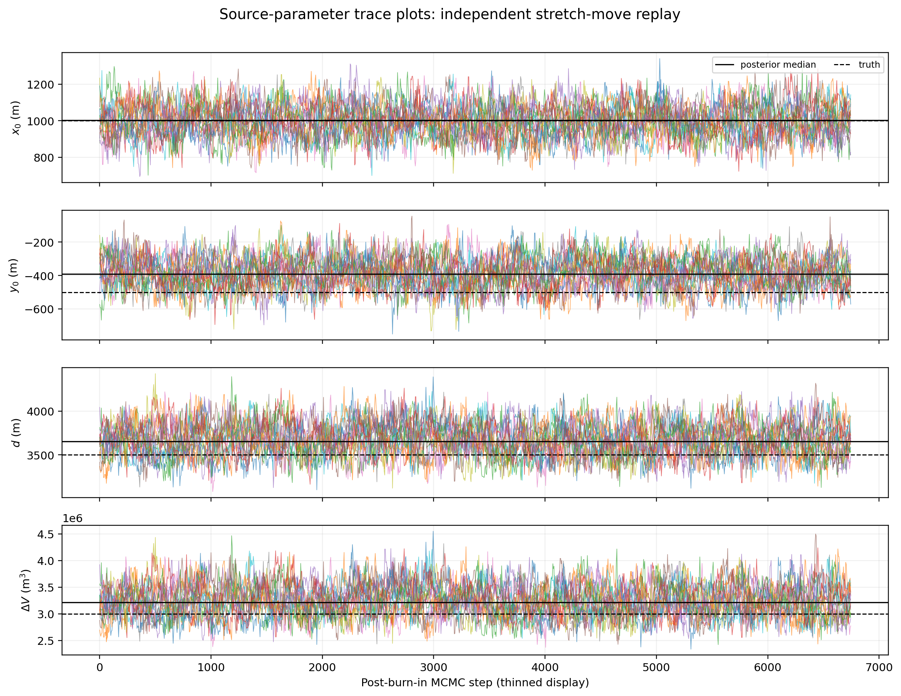
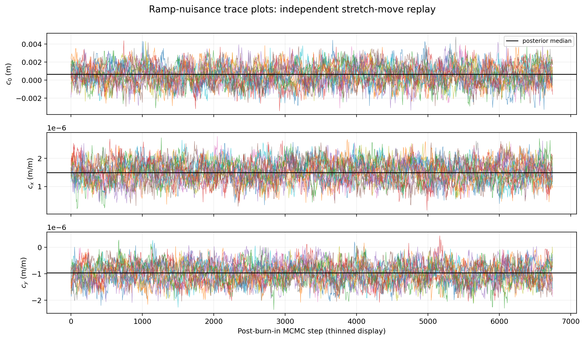
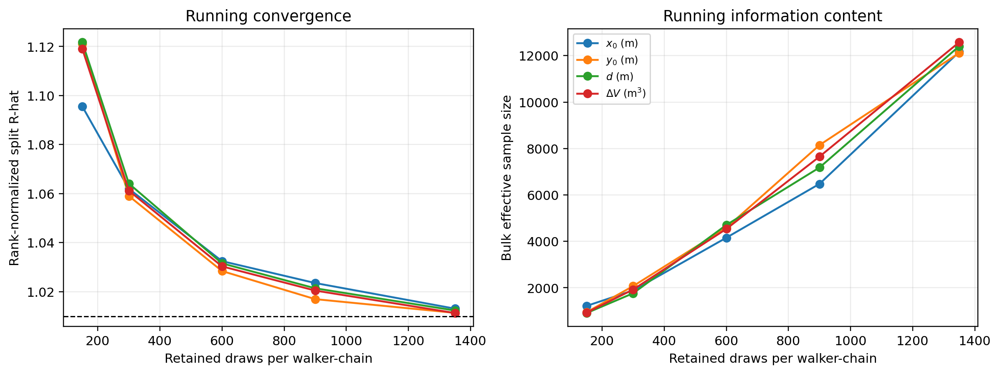
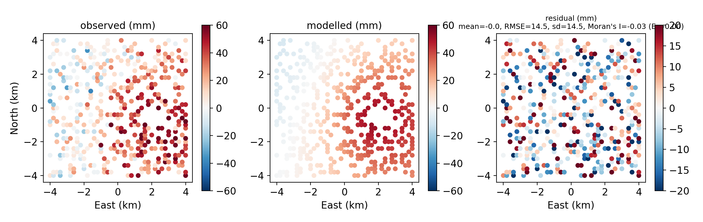
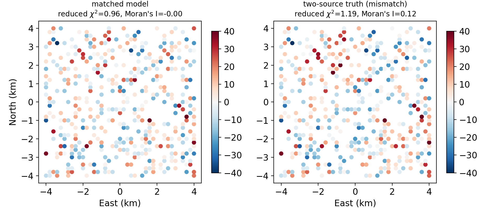

# Resource 3 Diagnostic Summary

**Article:** Explainable and Uncertainty-Aware Computational Geodetic Inversion: A Review and Framework for Multi-Source Earth Observation  
**Journal:** Computers & Geosciences  
**Repository release:** v1.0.0  
**Fixed seed:** 20260729

## 1. Scope

The package documents a controlled same-model synthetic proof-of-concept. The primary reference results were generated by `or3_demo.py` using SciPy, emcee, corner, and ArviZ. The additional trace figures were generated by `or3_trace_replay.py`, an independent NumPy implementation of the Goodman-Weare stretch move using the same fixed observations, priors, bounds, and MCMC settings. Manuscript values remain those from the primary emcee run.

## 2. Fixed configuration

| Configuration item | Value |
|---|---|
| Random seed | 20260729 |
| Ground truth | x0 = 1000 m; y0 = -500 m; depth = 3500 m; DeltaV = 3.0e6 m^3 |
| InSAR geometry | 427 LOS samples; 200 m grid; descending ENU look vector approx. (0.6209, -0.1120, 0.7759) |
| GNSS geometry | 9 three-component stations |
| Noise | InSAR 15 mm; GNSS horizontal 2 mm; GNSS vertical 5 mm; Gaussian iid |
| Ramp | c0 + cx*x + cy*y estimated jointly as three InSAR nuisance parameters |
| Least squares | SciPy trust-region reflective (`trf`), Jacobian scaling, two-point finite differences, ftol = xtol = 1e-12 |
| Posterior sampler | 4 independently seeded ensembles x 40 walkers x 9000 steps; burn-in 2250; thinning 5 |

## 3. Primary reference diagnostics

| Diagnostic | Reference value |
|---|---:|
| Reduced chi-square | 0.981 |
| Observations / fitted parameters | 454 / 7 (dof = 447) |
| Residual mean / RMSE / standard deviation | -0.00 / 14.505 / 14.505 mm |
| Residual Moran's I | -0.0271 (null expectation -0.0023) |
| Nearest-neighbour correlation | -0.0191 |
| Rank-normalized split R-hat (source) | 1.0113, 1.0105, 1.0125, 1.0124 |
| Bulk ESS (source) | 13614, 13269, 12708, 12884 |
| Mean acceptance fraction | 0.485 |
| Integrated autocorrelation time | 72.8 steps |
| Mismatch reduced chi-square | matched 0.958; two-source 1.188 |
| Mismatch Moran's I | matched -0.0009; two-source 0.1205 |

## 4. Trace diagnostics

### Source parameters



### Planar-ramp nuisance parameters



### Running convergence diagnostics



## 5. Reference fit and structural mismatch

### Observed, modelled, and residual InSAR LOS fields



### Matched-model control versus structural mismatch



## 6. Machine-readable outputs

- `config.json` - fixed seed, truth, geometry, LOS convention, noise, ramp, priors, bounds, solver, and MCMC settings.
- `insar_obs.csv` / `gnss_obs.csv` - exact synthetic observations and assigned uncertainties.
- `diagnostics.json` - residual, MCMC, and mismatch statistics.
- `decision_record.json` - Layer-5 explainability record.
- `ablation.json` - sensor-removal results.
- `posterior_trace_samples_replay.npz` - replay chain archive.
- `trace_replay_diagnostics.json` - replay diagnostics.

## 7. Reproduction commands

```bash
pip install -r requirements_lock.txt
python or3_demo.py
python or3_trace_replay.py
```
